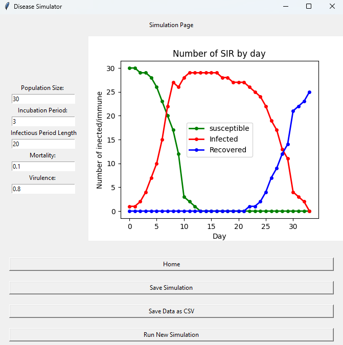

# An agent based model for the disease states SEIR

### SEIR

SEIR stands for 
* Susceptible
* Pre-Infectious
* Infected
* Recovered

## GUI

A tkinter GUI with matplotlib plots.
Currently only displays Susceptible, immune, and recovered plots.
The GUI allows for customization of the population size, the incubation period, the infection length, the mortality, and the virality.

